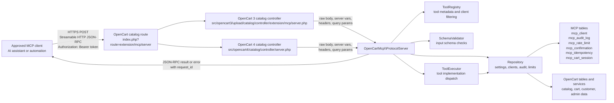
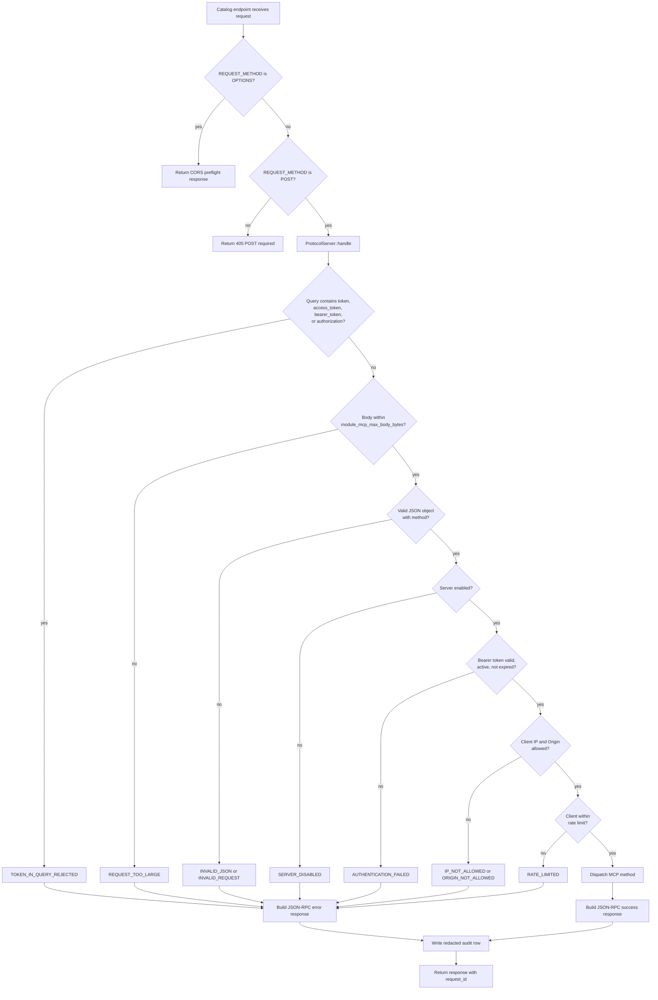
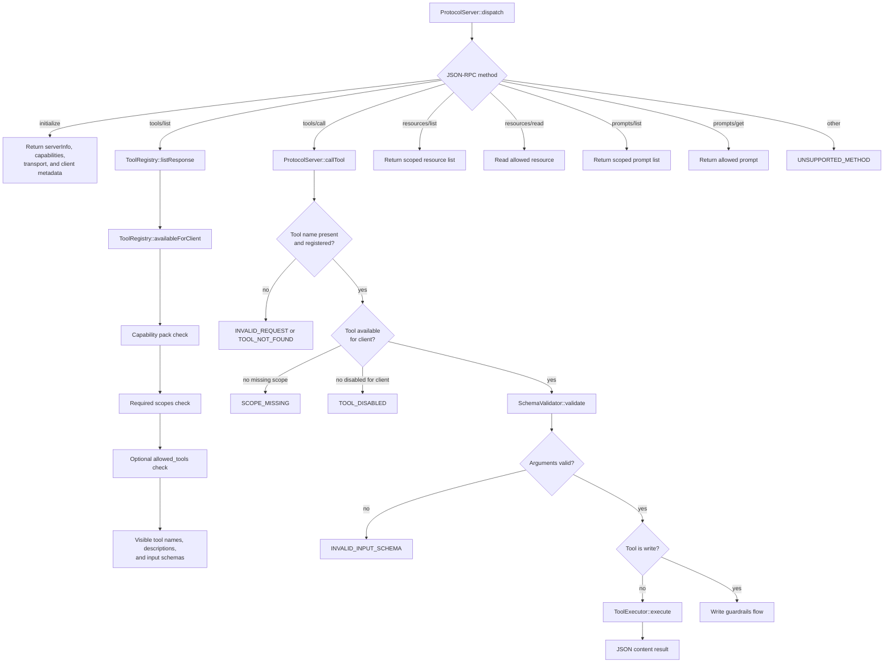
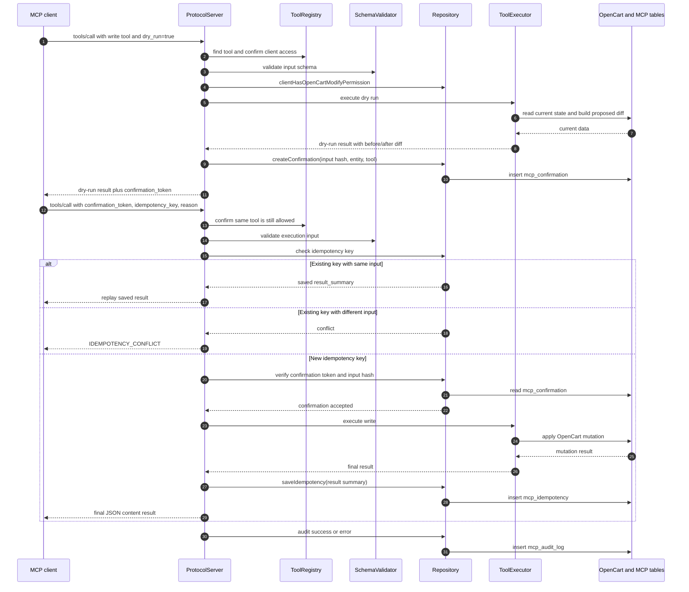

# Communication Layer Diagrams

These diagrams explain the current MCP communication path implemented by the OpenCart extension. They complement the high-level [architecture overview](../architecture.md) and the [tool catalog](../tools.md).

Relevant runtime files:

- [`ProtocolServer`](../../src/shared/system/library/mcp/protocol_server.php) handles JSON-RPC, authentication, policy checks, dispatch, responses, and audit writes.
- [`ToolRegistry`](../../src/shared/system/library/mcp/tool_registry.php) defines tools and filters them per client.
- [`SchemaValidator`](../../src/shared/system/library/mcp/schema_validator.php) validates tool arguments before execution.
- [`ToolExecutor`](../../src/shared/system/library/mcp/tools.php) calls the OpenCart-facing operations.
- [`Repository`](../../src/shared/system/library/mcp/repository.php) owns configuration, client lookup, rate limits, confirmations, idempotency, audit logging, and OpenCart database access.

## Communication Context

The OpenCart 3 and OpenCart 4 controllers are thin adapters. Shared protocol behavior stays in `src/shared/system/library/mcp/`.

## Request Lifecycle

Every handled JSON-RPC request receives a generated `request_id`. Audit logging records redacted input, result or error summary, client context, method, tool, risk tier, policy results, and duration.

## Tool Dispatch

Tool exposure is explicit. Clients only see and call tools allowed by their capability packs, scopes, and optional tool allowlist.

## Write Tool Guardrails

Write tools require the same protocol gate as read tools, plus OpenCart MCP modify permission for the client creator user group. Mutating execution is separated from dry-run preview by confirmation and idempotency checks.
